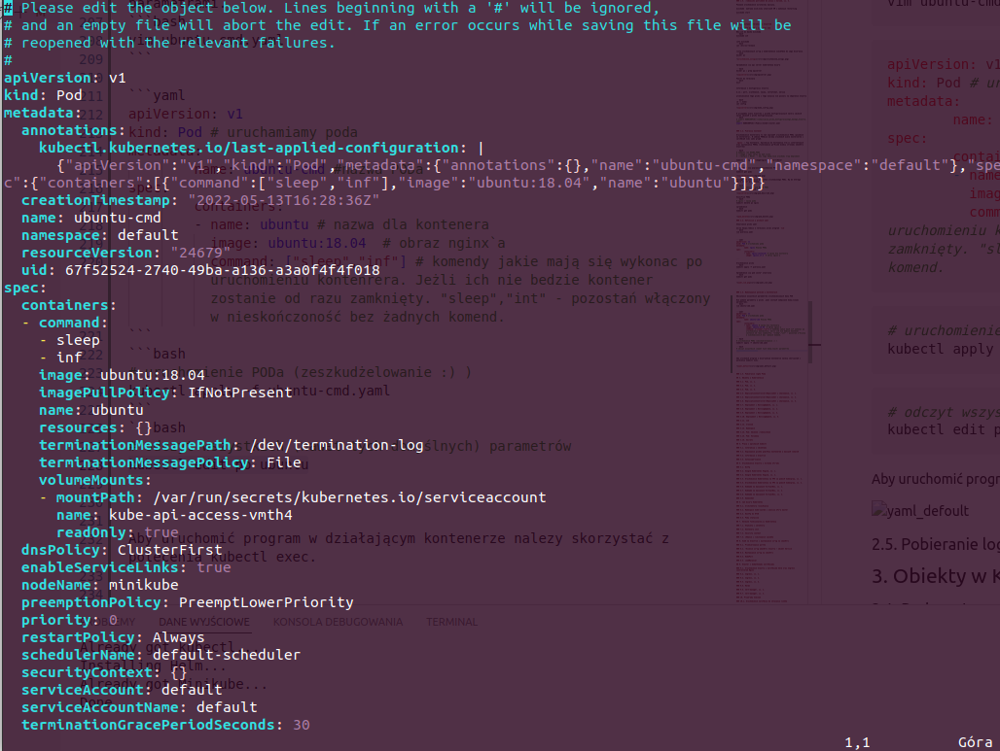

# Kubernetes tutorial
https://helion.pl/ksiazki/kubernetes-kurs-video-wdrazanie-aplikacji-michal-zylowski,vuruap.htm


## 1. Wstęp

### 1.1. Przywitanie i omówienie kursu

### 1.2. O Kubernetesie w kilka minut

### 1.3. Środowisko potrzebne do pracy z kursem, cz. 1.

`Minikube`
autmat do uruchomienia napisany w GO (mac, windows, linux). Wspiera kilka systemów virtualizacji (np. KVM2, hyperkit, virtualbox). 
Aplikacja która po uruchomieniu utworzy nam Wirtualną maszynę i skonfigurują ją jako jednowęzłowy lokalnym klaster kubernetesa. 

Pobierz i zainstaluj:

Virtual Box

https://www.virtualbox.org/wiki/Linux_Downloads


### 1.4. Środowisko potrzebne do pracy z kursem, cz. 2.

Pobierz i zainstaluj:

Kubectl

https://kubernetes.io/docs/tasks/tools/install-kubectl-linux/#install-kubectl-binary-with-curl-on-linux


Minikube

https://github.com/kubernetes/minikube
```
curl -LO https://storage.googleapis.com/minikube/releases/latest/minikube-linux-amd64
sudo install minikube-linux-amd64 /usr/local/bin/minikube

```

Uruchom Minikube
```
minikube start
```

Sprawdzić czy wszystkko przebiegło poprawnie
```
kubectl get nodes
```
 


### 1.5. Środowisko potrzebne do pracy z kursem, cz. 3.

Ponowne uruchomienie wirutalnej maszyny.

minikube  wykrywa wcześniej utworzoną VM i wykonuje restarting
```
minikube start
```


## 2. Podstawy interakcji z klastrem

### 2.1. Jak działa i czym jest kub

Wejście do basha minikuba
```bash
minikube ssh
```

info minikube
```bash
cat /etc/os-release
```

lista uruchomionych usług w kubernetesie niezbędne do jego działania
```bash
docker ps
```
 


Sprawdzenie czy api server kubernetesa działa

```bash
docker ps | grep apiserver
```
  

Powrót do terminala 
```bash
exit
```

Informacje o konfiguracji klastra

m.in.: port, użytkownik, nazwa, certyfikat, wersja 

przeniesienie tego pliku z tego miejsca nie pozowli na odpalenie klastra

```bash
cd ~/.kube/
cat config
```
  


W przypadku wielu klastrów i plików konfiguracyjnych należy zmienić tylko zmienną w pliku konfiguracyjnym.
```bash
# export KUBECONFIG=~/lokazliacja_pliku_konfiguracyjnego_danego_klastra.yaml
export KUBECONFIG=~/Public/3node-claster.yaml
```


### 2.2. Pierwszy kontener

Uruchoemienie konternera to tak naprawdę uruchoemienie PODa (pojemnik na konternery). W jednym PODdzie możemy uruchomić wiele konternerów i zarządzać nimi jako grupą. 

`nginx` - Typ kontenera. Aplikacja do hostowania treści internetowych oraz wystawiania PROXy (tunelowania połączeń miedzy stronami wewnątrz klastrów)

```bash
# kubectl run NAZWA_PODA
# --image = jaki obraz ma być użyty
# --restart = Never  - bez tego domyślnie uruchomi tryp deploment

kubectl run nginx --image=nginx --restart=Never
```


sprawdzenie czy poprawnie uruchomiono PODy
```bash
kubeclt get pods
```
  

Szczegółowe informacje dotyczące uruchomionego PODu. Np do którego węzła został przypisany. 

```bash
# kubeclt describe pod NAZWA PODu
kubectl describe pod nginx
```
  

Usunięcie PODa
```bash
# nginx - nazwa poda
kubectl delete po nginx
```
sprawdzenie
```bash
kubectl get pods
```


### 2.3. Definicje w plikach yaml

Utworzenie pliku yaml

można bezpośrednio w terminalu przez program `vim`
```bash
vim pierwszy.yaml
```


```yaml
apiVersion: v1
kind: Pod # uruchamiamy poda
metadata:
        name: nginx #nazwa PODa
spec:
        containers:
        - name: nginx-container # nazwa dla kontenera
          image: nginx1.17.2  # obraz nginx`a

```

Uruchomienie pliku 
```bash
kubectl apply -f pierwszy.yaml
```

Sprawdzenie czy pod został utworzony
```bash
kubectl get pods
```


### 2.4. Wykonywanie poleceń w kontenerach

Odczytanie wszystkich parametrów uruchomieniowych dany PAD

Nie podane parametry w pliku .yaml zostają nadpisane domyślinymi parametrami. 
```bash
vim ubuntu-cmd.yaml
```

```yaml
apiVersion: v1
kind: Pod # uruchamiamy poda
metadata:
        name: ubuntu-cmd #nazwa PODa
spec:
        containers:
        - name: ubuntu # nazwa dla kontenera
          image: ubuntu:18.04  # obraz nginx`a
          command: ["sleep","inf"] # komendy jakie mają się wykonac po uruchomieniu kontenrera. Jeżli ich nie bedzie kontener zostanie od razu zamknięty. "sleep","int" - pozostań włączony w nieskończoność bez żadnych komend. 
```
```bash
# uruchomienie PODa (zeszkudżelowanie :) )
kubectl apply -f ubuntu-cmd.yaml
```
```bash
# odczyt wszystkich (nawet tych domyślnych) parametrów 
kubectl edit po ubuntu
```



Aby uruchomić program w działającym kontenerze nalezy skorzystać z polecenia kubectl exec.

* W przypadku gdy POD zawiera jeden kontener wystarczy wyspecifikować nazwę POD'a: `kubectl exec [POD_NAME] [COMMAND]`.

* Gdy POD posiada kilka kontenerów musimy wskazać właściwy za pomocą opcji `-c`: `kubectl exec [POD_NAME] -c [CONTAINER_NAME] [COMMAND]`. Listę kontenerów i ich nazwy można uzyskać poprzez wpisanie polecenia `kubectl describe [POD_NAME]`.


Lista folderów głownego katalogu danego kontenera
```bash
kubectl exec ubuntu-cmd ls 
```

Lista procesów uruchomionych na kontenerze 
```bash
kubectl exec ubuntu-cmd ps aux
```


Opcja `-it` (interaktywna - uruchomienie basha kontenera) pozwala nam na 'wejście' do działającego kontenera.
```bash
kubectl exec -it ubuntu-cmd bash
```

```bash
ls
ps aux
```


### 2.5. Pobieranie logów Poda

Uruchomienie PODa z dwoma kontenerami 
```bash
vim logs.yaml
```

```yaml
apiVersion: v1
kind: Pod # uruchamiamy poda
metadata:
        name: logs-learning #nazwa PODa
spec:
        containers:
        - name: ubuntu # nazwa dla kontenera
          image: ubuntu:18.04  # obraz nginx`a
          command: ["sleep","inf"]
        - name: nginx
          image: nginx
          ports:
            - containerPort: 80
```
```bash
# uruchomienie PODa )
kubectl apply -f logs.yaml
```

Pobieranie logów z Poda
```bash
# -f powodnuje tryb czuwania, kazdy nowy log od razu się wyświteli. Uniemożliwa dalszą prace w danym okienku bez wyłączenia tego tryby (ctr+c)
kubectl logs logs-learning -c nginx -f
```
*symulacja logów* 
instaluje w danym kontenerze biblioteke `curl`, w celu pobierania stron wwww. - Komunikacja z nimi będzi zapisywana w logach
```bash
kubectl exec -c ubuntu -it logs-learning -- bash
```
Upewnienie się czy jesteśmy na poprwanym kontenerze
```bash
cat /etc/os-release
```
Akutalizacja systemu i pobranie biblioteki curl
```bash
apt update && apt install curl
```
Sprawdzenie jaki IP ma nasz POD
```bash
# sekcja IP
kubectl describe pod logs-learning
```
Pobranie strony dwukrotnie
```bash
curl 172.17.0.3
curl 172.17.0.3
```
Odczytanie logów
```bash
apt update && apt install curl
```


```bash
kubectl logs logs-learning -c nginx -f
```


## 3. Obiekty w Kubernetesie

### 3.1. Pod, cz. 1.


**POD**


Pojemnik, który musi mieć przynajmniej jeden kontener oraz stały adres IP. 

Do PODa można podłączyć **volumen**, który służy do podłączenia przestrzeni dyskowych, aby aplikacja mogła przechowywać dane. POD może mieć wiele konternerów oraz podłączony volumen współdzieli przestrzeń dyskową ze wszystkimi konterenami w danym PODzie. 


**NODE**


### 3.2. Pod, cz. 2.

### 3.3. Pod, cz. 3.

### 3.4. ReplicationController/ReplicaSet i skalowanie, cz. 1.

**Replikacja**, czyli uruchamianie kopii danego PODa wielokrotnie. Najlepiej na róznych Nodach (węzłach). Dzięki niej aplikacja są niezwodne, równoważą obciążenia serwera oraz są skalowalne. 

Przykład zastosowania:
nginx hostujący sklep intenetowy.

* **niezawodność** - Programista zepsuł kod powodujać błąd na stronie. Możemy uruchomic X replik na klastrze. Mimo problemu w jednym klastrze mamy uruchomione kopie kolejnego

* **równowaznenie obciążenia** - Okres świąteczny, zmożony ruch klientów możemy kierować ruch na inne kopie sklepu. 

* **skalowalność** - szybkie zwiększenie lub zminejszenie ilości replik (PODów). Nawet równowarząc po równo ruch nie pomaga, potrzebujemy więcej replik 


**ReplicationController**  - Obiekt pilnujący, aby akutalnie było uruchomionych tyle replik ile zdefiniowaliśmy. Bardzo żadko używany poniważ obiekt Deployment korzysta z jego odpowiednika ReplicationSet i robi to w sposób automatyczny. 


### 3.5. ReplicationController/ReplicaSet i skalowanie, cz. 2.
ReplicationController - case

### 3.6. ReplicationController/ReplicaSet i skalowanie, cz. 3.
ReplicaSet - case

utworz plik ReplicaSet

Jako ustawienia przyjmij utworzenie **5 replik**

```bash
vim rs.yaml
```

```yaml
apiVersion: apps/v1
kind: ReplicaSet
metadata:
  name: httpd-rs
spec:
  replicas: 5
  selector:
    matchLabels:
      app: httpd-app-rs
  template:
    metadata:
      name: httpd-pod-rs
      labels:
        app: httpd-app-rs
    spec:
      containers:
      - name: httpd-container
        image: httpd
        ports:
        - containerPort: 80
```
Uruchomienie Poda
```bash
kubectl apply -f rs.yaml

#sprawdznie ilosci podów
kubectl get po
```


Zredukowanie PODów do **3 replik** 

```bash
kubectl  scale rs --replicas=3 httpd-rs

#sprawdznie ilosci podów
kubectl get po
```


### 3.7. Deployment i RollingUpdate, cz. 1.

**Deployment**
Używamy go zawsze kiedy chcemy aby nasza aplikacja działałą stale

```bash
vim deployment.yaml
```

```yaml
apiVersion: apps/v1
kind: Deployment
metadata:
  name: httpd-dep
  labels:
    app: httpd-app
spec:
  replicas: 5
  selector:
    matchLabels:
      app: httpd-app
  template: 
    metadata:
      labels:
        app: httpd-app
    spec:
      containers:
      - name: httpd 
        image: httpd
        ports:
        - containerPort: 80
```


### 3.8. Deployment i RollingUpdate, cz. 2.

TIP konsola bash podzielona na na wiele okien aby kontrolowa wszystko naraz
```bash
tmux
# podstawowy skrót skórt ctrl+b inicjuje wejście do zarządzania oknami, uruchomiamy go przed kazdy poniższym
# shift+5 (czyli %) - podział ekranu pionowo
# shift+" (czyli ") - podział ekranu poziomo
# ctrl+(strzałka) - zmiana wielkości okien
# (strzałka) - przechodzenie pomiędzy oknami 
# ctrl+z - zoom na dany panel powrót ta sama komenda
# exit - usun 
# c - utworz nową zakładkę z nowym oknem(stare bedzie zachowane)
# p - (prev) - przełącz zakładkę na poprzedni
# n - (next) - przełącz zakładkę na nastepne


# okno 4
watch -n 1 "kubectl get po"
# okno 3
watch -n 1 "kubectl get deployments"
# okno 2
watch -n 1 "kubectl get rs"
# okno 1 - posłuży do wydawania koment
```


**Zmiana wersje naszego obrazu**
```bash
#--record=true  (zapisze informacje o zmianie)
kubectl set image deployment httpd-dep httpd=httpd:2.4 --record=true
```

**Podgląd najważniejszych parametrów**

```bash
kubectl describe deployment httpd-dep
```


### 3.9. Deployment i RollingUpdate, cz. 3.

**lista komend rolloutowych**
```bash
kubectl rollout
```


**Podgląd listy ostatnich rolloutów**
```bash
kubectl rollout history deployment httpd-dep
```


**Wycofanie rolloutu Deploymentu** - ostatnio wprowadzonych zmian z listy 
```bash
kubectl rollout undo deployment httpd-dep
```


**Sprawdzenie Deploymenty działają poprawnie** 
```bash
kubectl rollout status deployment httpd-dep
```


### 3.10. Deployment i RollingUpdate, cz. 4.

**Usunięcie / Przerwanie działania Deploymentu**
```bash
kubectl delete deployment httpd-dep
```


### 3.11. Job

### 3.12. CronJob

### 3.13. Namespace

### 3.14. Pod: Zmienne środowiskowe

### 3.15. Pod: Volumeny

### 3.16. Secrets

## 4. Praca z aplikacją kubectl

### 4.1. Interakcja z obiektami

### 4.2. Kopiowanie plików pomiędzy kontenerem a maszyną lokalną

### 4.3. Informacje o klastrze

### 4.4. Autouzupełnianie

## 5. Uruchomienie klastra z kilkoma węzłami

### 5.1. Wstęp

### 5.2. Google Kubernetes Engine, cz. 1.

### 5.3. Google Kubernetes Engine, cz. 2.

### 5.4. Uruchomienie Kubernetesa na VPS za pomocą kubespray, cz. 1.

### 5.5. Uruchomienie Kubernetesa na VPS za pomocą kubespray, cz. 2.

### 5.6. Kubeadm na maszynach VirtualBox, cz. 1.

### 5.7. Kubeadm na maszynach VirtualBox, cz. 2.

### 5.8. Kubeadm na maszynach VirtualBox, cz. 3.

### 5.9. DaemonSet

## 6. Jak działa Kubernetes

### 6.1. Architektura rozwiązania

### 6.2. Namespace kube-system i analiza węzła master

### 6.3. Dostęp do ETCD

### 6.4. Pody statyczne

## 7. Kolejne funkcjonalności Kubernetesa

### 7.1. Etykiety i selektory

### 7.2. Kontenery init

### 7.3. Security context

### 7.4. Żądanie i limitowanie zasobów

## 8. Sieć na klastrze i wystawianie usług na zewnątrz

### 8.1. Przekierowanie portów

### 8.2. Łączenie usług wewnątrz klastra - obiekt Service

### 8.3. Wystawianie usług na zewnątrz

### 8.4. NodePort

### 8.5. LoadBalancer

## 9. Klaster z dodatkowymi narzędziami

### 9.1. Uruchomienie klastra z narzędziem helm oraz Ingress controllerem Nginx

### 9.2. Ingress, cz. 1.

### 9.3. Ingress, cz. 2.

### 9.4. Ingress, cz. 3.

### 9.5. Helm1

### 9.6. Cert-manager, cz. 1.

### 9.7. Cert-manager, cz. 2.

### 10. Przykłady końcowe

### 10.1. Uruchomienie narzędzia do skracania linków

### 10.2. Podłączenie klastra do projektów obliczeniowych
