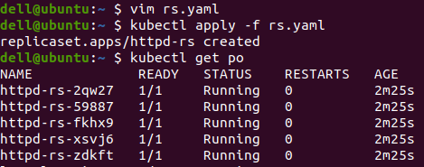
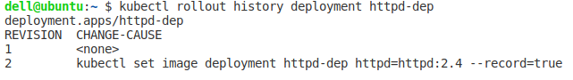
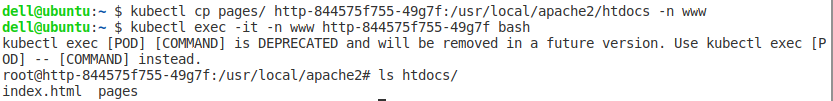
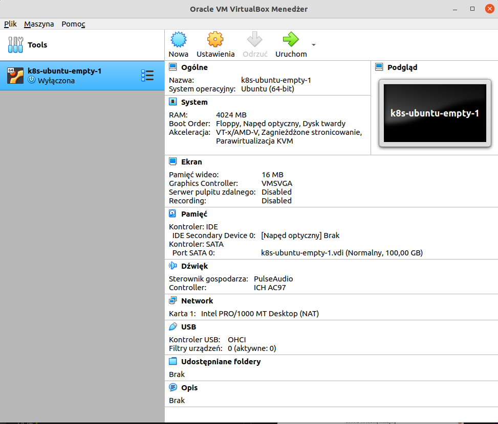

# Kubernetes tutorial
https://helion.pl/ksiazki/kubernetes-kurs-video-wdrazanie-aplikacji-michal-zylowski,vuruap.htm


## 1. Wstęp

### 1.1. Przywitanie i omówienie kursu

### 1.2. O Kubernetesie w kilka minut

### 1.3. Środowisko potrzebne do pracy z kursem, cz. 1.

`Minikube`
autmat do uruchomienia napisany w GO (mac, windows, linux). Wspiera kilka systemów virtualizacji (np. KVM2, hyperkit, virtualbox). 
Aplikacja która po uruchomieniu utworzy nam Wirtualną maszynę i skonfigurują ją jako jednowęzłowy lokalnym klaster kubernetesa. 

Pobierz i zainstaluj:

Virtual Box

https://www.virtualbox.org/wiki/Linux_Downloads


### 1.4. Środowisko potrzebne do pracy z kursem, cz. 2.

Pobierz i zainstaluj:

Kubectl

https://kubernetes.io/docs/tasks/tools/install-kubectl-linux/#install-kubectl-binary-with-curl-on-linux


Minikube

https://github.com/kubernetes/minikube
```
curl -LO https://storage.googleapis.com/minikube/releases/latest/minikube-linux-amd64
sudo install minikube-linux-amd64 /usr/local/bin/minikube

```

Uruchom Minikube
```
minikube start
```

Sprawdzić czy wszystkko przebiegło poprawnie
```
kubectl get nodes
```
 


### 1.5. Środowisko potrzebne do pracy z kursem, cz. 3.

Ponowne uruchomienie wirutalnej maszyny.

minikube  wykrywa wcześniej utworzoną VM i wykonuje restarting
```
minikube start
```


## 2. Podstawy interakcji z klastrem

### 2.1. Jak działa i czym jest kub

Wejście do basha minikuba
```bash
minikube ssh
```

info minikube
```bash
cat /etc/os-release
```

lista uruchomionych usług w kubernetesie niezbędne do jego działania
```bash
docker ps
```
 


Sprawdzenie czy api server kubernetesa działa

```bash
docker ps | grep apiserver
```
  

Powrót do terminala 
```bash
exit
```

Informacje o konfiguracji klastra

m.in.: port, użytkownik, nazwa, certyfikat, wersja 

przeniesienie tego pliku z tego miejsca nie pozowli na odpalenie klastra

```bash
cd ~/.kube/
cat config
```
  


W przypadku wielu klastrów i plików konfiguracyjnych należy zmienić tylko zmienną w pliku konfiguracyjnym.
```bash
# export KUBECONFIG=~/lokazliacja_pliku_konfiguracyjnego_danego_klastra.yaml
export KUBECONFIG=~/Public/3node-claster.yaml
```


### 2.2. Pierwszy kontener

Uruchoemienie konternera to tak naprawdę uruchoemienie PODa (pojemnik na konternery). W jednym PODdzie możemy uruchomić wiele konternerów i zarządzać nimi jako grupą. 

`nginx` - Typ kontenera. Aplikacja do hostowania treści internetowych oraz wystawiania PROXy (tunelowania połączeń miedzy stronami wewnątrz klastrów)

```bash
# kubectl run NAZWA_PODA
# --image = jaki obraz ma być użyty
# --restart = Never  - bez tego domyślnie uruchomi tryp deploment

kubectl run nginx --image=nginx --restart=Never
```


sprawdzenie czy poprawnie uruchomiono PODy
```bash
kubeclt get pods
```
  

Szczegółowe informacje dotyczące uruchomionego PODu. Np do którego węzła został przypisany. 

```bash
# kubeclt describe pod NAZWA PODu
kubectl describe pod nginx
```
  

Usunięcie PODa
```bash
# nginx - nazwa poda
kubectl delete po nginx
```
sprawdzenie
```bash
kubectl get pods
```


### 2.3. Definicje w plikach yaml

Utworzenie pliku yaml

można bezpośrednio w terminalu przez program `vim`
```bash
vim pierwszy.yaml
```


```yaml
apiVersion: v1
kind: Pod # uruchamiamy poda
metadata:
        name: nginx #nazwa PODa
spec:
        containers:
        - name: nginx-container # nazwa dla kontenera
          image: nginx1.17.2  # obraz nginx`a

```

Uruchomienie pliku 
```bash
kubectl apply -f pierwszy.yaml
```

Sprawdzenie czy pod został utworzony
```bash
kubectl get pods
```


### 2.4. Wykonywanie poleceń w kontenerach

Odczytanie wszystkich parametrów uruchomieniowych dany PAD

Nie podane parametry w pliku .yaml zostają nadpisane domyślinymi parametrami. 
```bash
vim ubuntu-cmd.yaml
```

```yaml
apiVersion: v1
kind: Pod # uruchamiamy poda
metadata:
        name: ubuntu-cmd #nazwa PODa
spec:
        containers:
        - name: ubuntu # nazwa dla kontenera
          image: ubuntu:18.04  # obraz nginx`a
          command: ["sleep","inf"] # komendy jakie mają się wykonac po uruchomieniu kontenrera. Jeżli ich nie bedzie kontener zostanie od razu zamknięty. "sleep","int" - pozostań włączony w nieskończoność bez żadnych komend. 
```
```bash
# uruchomienie PODa (zeszkudżelowanie :) )
kubectl apply -f ubuntu-cmd.yaml
```
```bash
# odczyt wszystkich (nawet tych domyślnych) parametrów 
kubectl edit po ubuntu
```


Aby uruchomić program w działającym kontenerze nalezy skorzystać z polecenia kubectl exec.

* W przypadku gdy POD zawiera jeden kontener wystarczy wyspecifikować nazwę POD'a: `kubectl exec [POD_NAME] [COMMAND]`.

* Gdy POD posiada kilka kontenerów musimy wskazać właściwy za pomocą opcji `-c`: `kubectl exec [POD_NAME] -c [CONTAINER_NAME] [COMMAND]`. Listę kontenerów i ich nazwy można uzyskać poprzez wpisanie polecenia `kubectl describe [POD_NAME]`.


Lista folderów głownego katalogu danego kontenera
```bash
kubectl exec ubuntu-cmd ls 
```

Lista procesów uruchomionych na kontenerze 
```bash
kubectl exec ubuntu-cmd ps aux
```


Opcja `-it` (interaktywna - uruchomienie basha kontenera) pozwala nam na 'wejście' do działającego kontenera.
```bash
kubectl exec -it ubuntu-cmd bash
```

```bash
ls
ps aux
```


### 2.5. Pobieranie logów Poda

Uruchomienie PODa z dwoma kontenerami 
```bash
vim logs.yaml
```

```yaml
apiVersion: v1
kind: Pod # uruchamiamy poda
metadata:
        name: logs-learning #nazwa PODa
spec:
        containers:
        - name: ubuntu # nazwa dla kontenera
          image: ubuntu:18.04  # obraz nginx`a
          command: ["sleep","inf"]
        - name: nginx
          image: nginx
          ports:
            - containerPort: 80
```
```bash
# uruchomienie PODa )
kubectl apply -f logs.yaml
```

Pobieranie logów z Poda
```bash
# -f powodnuje tryb czuwania, kazdy nowy log od razu się wyświteli. Uniemożliwa dalszą prace w danym okienku bez wyłączenia tego tryby (ctr+c)
kubectl logs logs-learning -c nginx -f
```
*symulacja logów* 
instaluje w danym kontenerze biblioteke `curl`, w celu pobierania stron wwww. - Komunikacja z nimi będzi zapisywana w logach
```bash
kubectl exec -c ubuntu -it logs-learning -- bash
```
Upewnienie się czy jesteśmy na poprwanym kontenerze
```bash
cat /etc/os-release
```
Akutalizacja systemu i pobranie biblioteki curl
```bash
apt update && apt install curl
```
Sprawdzenie jaki IP ma nasz POD
```bash
# sekcja IP
kubectl describe pod logs-learning
```
Pobranie strony dwukrotnie
```bash
curl 172.17.0.3
curl 172.17.0.3
```
Odczytanie logów
```bash
apt update && apt install curl
```


```bash
kubectl logs logs-learning -c nginx -f
```


## 3. Obiekty w Kubernetesie

### 3.1. Pod, cz. 1.


**POD**


Pojemnik, który musi mieć przynajmniej jeden kontener oraz stały adres IP. 

Do PODa można podłączyć **volumen**, który służy do podłączenia przestrzeni dyskowych, aby aplikacja mogła przechowywać dane. POD może mieć wiele konternerów oraz podłączony volumen współdzieli przestrzeń dyskową ze wszystkimi konterenami w danym PODzie. 


**NODE**


### 3.2. Pod, cz. 2.

### 3.3. Pod, cz. 3.

### 3.4. ReplicationController/ReplicaSet i skalowanie, cz. 1.

**Replikacja**, czyli uruchamianie kopii danego PODa wielokrotnie. Najlepiej na róznych Nodach (węzłach). Dzięki niej aplikacja są niezwodne, równoważą obciążenia serwera oraz są skalowalne. 

Przykład zastosowania:
nginx hostujący sklep intenetowy.

* **niezawodność** - Programista zepsuł kod powodujać błąd na stronie. Możemy uruchomic X replik na klastrze. Mimo problemu w jednym klastrze mamy uruchomione kopie kolejnego

* **równowaznenie obciążenia** - Okres świąteczny, zmożony ruch klientów możemy kierować ruch na inne kopie sklepu. 

* **skalowalność** - szybkie zwiększenie lub zminejszenie ilości replik (PODów). Nawet równowarząc po równo ruch nie pomaga, potrzebujemy więcej replik 


**ReplicationController**  - Obiekt pilnujący, aby akutalnie było uruchomionych tyle replik ile zdefiniowaliśmy. Bardzo żadko używany poniważ obiekt Deployment korzysta z jego odpowiednika ReplicationSet i robi to w sposób automatyczny. 


### 3.5. ReplicationController/ReplicaSet i skalowanie, cz. 2.
ReplicationController - case

### 3.6. ReplicationController/ReplicaSet i skalowanie, cz. 3.
ReplicaSet - case

utworz plik ReplicaSet

Jako ustawienia przyjmij utworzenie **5 replik**

```bash
vim rs.yaml
```

```yaml
apiVersion: apps/v1
kind: ReplicaSet
metadata:
  name: httpd-rs
spec:
  replicas: 5
  selector:
    matchLabels:
      app: httpd-app-rs
  template:
    metadata:
      name: httpd-pod-rs
      labels:
        app: httpd-app-rs
    spec:
      containers:
      - name: httpd-container
        image: httpd
        ports:
        - containerPort: 80
```
Uruchomienie Poda
```bash
kubectl apply -f rs.yaml

#sprawdznie ilosci podów
kubectl get po
```



Zredukowanie PODów do **3 replik** 

```bash
kubectl  scale rs --replicas=3 httpd-rs

#sprawdznie ilosci podów
kubectl get po
```


### 3.7. Deployment i RollingUpdate, cz. 1.

**Deployment**
Używamy go zawsze kiedy chcemy aby nasza aplikacja działałą stale

```bash
vim deployment.yaml
```

```yaml
apiVersion: apps/v1
kind: Deployment
metadata:
  name: httpd-dep
  labels:
    app: httpd-app
spec:
  replicas: 5
  selector:
    matchLabels:
      app: httpd-app
  template: 
    metadata:
      labels:
        app: httpd-app
    spec:
      containers:
      - name: httpd 
        image: httpd
        ports:
        - containerPort: 80
```


### 3.8. Deployment i RollingUpdate, cz. 2.

TIP konsola bash podzielona na na wiele okien aby kontrolowa wszystko naraz
```bash
tmux
# podstawowy skrót skórt ctrl+b inicjuje wejście do zarządzania oknami, uruchomiamy go przed kazdy poniższym
# shift+5 (czyli %) - podział ekranu pionowo
# shift+" (czyli ") - podział ekranu poziomo
# ctrl+(strzałka) - zmiana wielkości okien
# (strzałka) - przechodzenie pomiędzy oknami 
# ctrl+z - zoom na dany panel powrót ta sama komenda
# exit - usun 
# c - utworz nową zakładkę z nowym oknem(stare bedzie zachowane)
# p - (prev) - przełącz zakładkę na poprzedni
# n - (next) - przełącz zakładkę na nastepne


# okno 4
watch -n 1 "kubectl get po"
# okno 3
watch -n 1 "kubectl get deployments"
# okno 2
watch -n 1 "kubectl get rs"
# okno 1 - posłuży do wydawania koment
```


**Zmiana wersje naszego obrazu**
```bash
#--record=true  (zapisze informacje o zmianie)
kubectl set image deployment httpd-dep httpd=httpd:2.4 --record=true
```

**Podgląd najważniejszych parametrów**

```bash
kubectl describe deployment httpd-dep
```


### 3.9. Deployment i RollingUpdate, cz. 3.

**lista komend rolloutowych**
```bash
kubectl rollout
```


**Podgląd listy ostatnich rolloutów**
```bash
kubectl rollout history deployment httpd-dep
```




**Wycofanie rolloutu Deploymentu** - ostatnio wprowadzonych zmian z listy 
```bash
kubectl rollout undo deployment httpd-dep
```


**Sprawdzenie Deploymenty działają poprawnie** 
```bash
kubectl rollout status deployment httpd-dep
```


### 3.10. Deployment i RollingUpdate, cz. 4.

**Usunięcie / Przerwanie działania Deploymentu**
```bash
kubectl delete deployment httpd-dep
```


### 3.11. Job

**Job** w kubernetesie to byty odpowiedzialne za jednorazowe uruchamianie zadań i nie podtrzymywanie poda przy życiu gdy ten poprawnie zakończy swoją pracę.

`Przykładowe zastosowanie` - Pobranie z platformy XYZ filmów. Można do tego zadanie użyć klaster kubernetesa ze względu na odpowiednią ilość przestrzeni dyskowej oraz przepustowości łącza.

Obraz dockerowy
https://hub.docker.com/r/wernight/youtube-dl

Github
https://github.com/wernight/docker-youtube-dl

Utworzenie pliku
```bash
vim job.yaml
```
```yaml
apiVersion: batch/v1
kind: Job
metadata:
  name: downloader
spec:
  template:
    spec:
      containers:
      - name: yt-downloader
        image: wernight/youtube-dl
        command: ["youtube-dl", "https://www.youtube.com/watch?v=pHwt5oC7_lQ"]
      restartPolicy: Never
```
Uruchomienie PODa
```bash
kubectl apply -f job.yaml
# sprawdzenie
kubectl get job
kubectl get po
```

Sprawdzenie `kolumny Message w części Events` dla każdego elementu
```bash
kubectl describe job
kubectl describe job downloader
#pod
kubectl describe po downloader-5bzzt
```

> **BŁĄD**: Robiąc dokładnie co prowadzący kurs. POD powinien być jeden ze statusem "Completed" (`get po`), natomiast  kolumna "completions" w `get jobs` powinna mieć wartość 1/1. Poniżej wszystkie parametry mogące pomoc namierzyć błąd. 
> 
> *Moja sugestia. Kurs był robiony w 2019, Skrypt z docker hub również. Miedzy czasie mogły powstać nowe wymogi dotyczące pobierania filmów z YouTuba (np indywidualne api). Przez co mimo poprawnej implementacji skypt nie może pobrać filmu z platformu.*


### 3.12. CronJob

**CronJob** pozwala na uruchomienie JOBa o określonej godzinie/dacie. 

Powiązana literatura:
* **Crontab.guru - Pomga zaplanować harmonogram !!!** Do nauki opisywania harmonogramów - https://crontab.guru/
* Kubernetes CronJob - https://kubernetes.io/docs/concepts/workloads/controllers/cron-jobs/
* Uruchamianie CronJobów - https://kubernetes.io/docs/tasks/job/automated-tasks-with-cron-jobs/
* API CronJoba w kubernetesie - https://kubernetes.io/docs/reference/generated/kubernetes-api/v1.15/#job-v1-batch


**Przykład - pobieranie pogody**
CronJob, który co minutę będzie uruchamiała Joba pobierającego informacje pogodowe

Github aplikacji - https://github.com/chubin/wttr.in


```bash
vim cron-job.yaml
```

```yaml
apiVersion: batch/v1beta1
kind: CronJob
metadata:
  name: downloader-cron
spec:
  schedule: "*/1 * * * *"
  jobTemplate:
    spec:
      template:
        spec:
          restartPolicy: Never
          containers:
          - name: downloader-container-cron
            image: pstauffer/curl
            command: ["curl", "-s", "http://wttr.in/Gdansk"]
```


* kubectl get cronjobs / kubectl get cj - status działającego cron-joba
* kubectl get job - akutalne statusy urachamianych jobów
* kubectl get po - statusy uruchamianych podów. W kolumnie AGE widać jak co 60sec zostaje uruchomiony nowy JOB, które stworzyły PODy. 

**Podgląd działania scryptu w logach**  - poniważ scrypt zwraca dane do terminla
```bash
# pobranie nazwy z listy PODów (kubectl get po)
kubectl logs downloader-cron-27543622-mpldp
```


**usunięcie cron-joba**
```bush
kubectl delete cj downloader-cron
```


### 3.13. Namespace

**Namespace** - pozwala na logiczne dzielenie klastra na części. Dzięki czemu w jednym klastrze może działać wiele obiektów. Domyślnie każdy obiekt ma przypisaną *namespace* na defoult.

* Kubernetes Namespace - https://kubernetes.io/docs/concepts/overview/working-with-objects/namespaces/
* Praca z przestrzeniami nazw - https://kubernetes.io/docs/tasks/administer-cluster/namespaces/
* Omówienie przestrzeni nazw - https://kubernetes.io/docs/tasks/administer-cluster/namespaces-walkthrough/
* API przestrzeni nazw w kubernetesie - https://kubernetes.io/docs/reference/generated/kubernetes-api/v1.15/#namespace-v1-core


```bash
kubectl get namespaces   # lub skrót kubectl get ns
```

**Utworzenie nowego NAMESPACE**

```bash
kubectl create ns test
```
sprawdzenie
```bash
kubectl get ns 
```


**Utworzenie NAMESPACE za pomocą pliku .yaml**
```bash
vim ns.yaml
```
```yaml
apiVersion: v1
kind: Namespace
metadata:
  name: yaml
```
aktywowanie pliku
```bash
kubectl apply -f ns.yaml
```


**Uruchomienie PODu w danym NAMESPACE**
```bash
kubectl apply -f deployment.yaml -n test
```

**Wyświetlanie obiektów NAMESPACEów**
Aby zobaczyć jakie PODy są w *namespace* do polecenia get należy dopisać nazwę *namespacu*. Domyślnie wyświetlany jest widok namespace defolut. Podobnie robimy przy innych obiektach. 
```bash
kubectl get po -n test
```


**Przypisanie obiektu do danego namespacu**
```bash
vim deployments.yaml
```
```yaml
apiVersion: apps/v1
kind: Deployment
metadata:
  namespace: yaml #nazwa namespacu
  name: httpd-dep
  labels:
    app: httpd-app
spec:
  replicas: 5
  selector:
    matchLabels:
      app: httpd-app
  template:
    metadata:
      labels:
        app: httpd-app
    spec:
      containers:
      - name: httpd
        image: httpd
        ports:
        - containerPort: 80
```
```bash
kubectl apply -f deployment.yaml -n yaml
```
```bash
kubectl get po -n yaml
```


**Wylistowanie WSZYSTKICH PODów ze WSZYSTKICH NAMESPACEów**
```bash
kubectl get po --all-namespaces
```


*NAMESPACE "kube-system" są wewnętrznymi PODami kubernetesa

**usunięcie danych NAMESPACE**
```bash
kubectl delete ns test
```
podgląd zmian
```bash
kubectl get po --all-namespaces
```


*UWAGA - zostaje również usunięty są POD*


### 3.14. Pod: Zmienne środowiskowe

```bash
vim env.yaml
```
```yaml
apiVersion: v1
kind: Pod
metadata:
  name: ubuntu-env
spec:
  containers:
  - name: ubuntu
    image: ubuntu:18:04
    command: ["env"]  #cmd env listuje wszystkie zmienne środowiskowe
  restartPolicy: Never
```
Wypisanie zmiennych
```bash
kubectl logs ubuntu-env
```


**Dodanie własnych zmiennych środowiskowych**

```yaml
apiVersion: v1
kind: Pod
metadata:
  name: ubuntu-my-envs
spec:
  containers:
  - name: ubuntu
    env:
    - name: SLEEP_TIME
      value: "10"
    - name: EXIT_CODE
      value: "2"
    image: ubuntu:18.04
    command: ["env"]
  restartPolicy: Never
```
```bash
kubectl logs ubuntu-my-envs
```


**Użycie zmiennych środowiskowych w aplikacji**

```yaml
apiVersion: v1
kind: Pod
metadata:
  name: ubuntu-my-envs
spec:
  containers:
  - name: ubuntu
    ########start
    env:
    - name: SLEEP_TIME
      value: "10"
    - name: EXIT_CODE
      value: "0"    #status zakończenia aplikacji. Ona definiuje jaki będzie status w get po . 0=Completed , 2=Error
    ########end
    image: ubuntu:18.04
    command: ["/bin/sh", "-c"]   # uruchomienie shella, parametr -c onacza niezależne linuxowe polecenia
    args: ["sleep $(SLEEP_TIME) && exit $(EXIT_CODE)"]  # cmd linuxowe z naszymi zmiennymi 
  restartPolicy: Never
```


**POBRANIE DANYCH Z VOLUMENU**

Lokalizacja klucza minikuba za pomocą którego zalogujemy sie do volumenu
```bash
minikube ssh-key
```

Adres IP 
```bash
minikube ip
```


**Pobieranie/Kopiowanie plików z VM**
```bash
scp -i $(minikube ssh-key) docker@$(minikube ip): /files/<nazwa_pliku.rozszerzenie> .
```


### 3.15. Pod: Volumeny

**VOLUMENY** pozwalają zamontować przestrzeń dyskową do podów.

```yaml
apiVersion: batch/v1
kind: Job
metadata:
  name: downloader
spec:
  template:
    spec:
      containers:
      - name: yt-downloader
        image: wernight/youtube-dl
        command: ["youtube-dl", "https://www.youtube.com/watch?v=iaN8X3p9gso"]
        ########start
        # sekcja łącząca dany kontenter z danym volumenem
        volumeMounts:
        - mountPath: /downloads  # miejsce w konterze w którym dany katalog ma się podmątować 
          name: first-volume #nazwa (ta sama co w sekcji volumes )
        ########end
      restartPolicy: Never
      ########start
      volumes:
      - name: first-volume   #nazwa (ta sama co w sekcji volumeMounts )
        hostPath:
          path: /files     # ścieżka 
          type: Directory  # zapisz w folderze
      ########end
```

```bash
kubectl apply -f job-volume.yaml
```


*Po utworzeniu PODA i sprawdznie jego statusu "containerCreating" chcemy sprawdzić dlaczego tak długo jest tworzony. W tym celu zaglądamy do środka danego poda*

```bash
kubectl describe po downloader-6b6bd
```


*Po Age (x9) widać, że było wiele prób które skończyły się "FailMount". Message mówi, że /file nie jest katalogiem. Przyczyną tego błędu jest to, że dany folder nie istnieje.*

**Rozwiązanie 1:** Utworzneie ręcznie katalogu

```bash
minikube ssh
sudo mkdir /files
exit
```


Usunięcie błędnego PODu
```bash
kubectl delete po downloader-6b6bd
```
Sprawdznie usnięcia
```bash
kubectl get po
```
Ponownie uruchomienie PODa - teraz po utworzeniu katalogu
```bash
kubectl apply -f job-volume.yaml
```


> **BŁAD** ponownie jak przy poprzeniej próbie pobrania plików z YT wystepuje błąd pobrania. Przez co nie możemy przetestowac zapisania w danym volumenie !  *Spróbuj pobrać jakieś zdjęcie i zapisz je w danym volumenie*
>
> Sprawdzenie czy pliki zostały pobrane
>
> 


**Rozwiązanie 2:** Zmiana w pliku .yaml parametru `type: Directory` na `type: DirectoryOrCreate`


### 3.16. Secrets

**Secret** słóżą do przekazywania poufnych danych (np.:login, hasło)

```bash
vim secret.yaml
```

```yaml
apiVersion: v1
kind: Secret
metadata:
  name: db-secret
data:
  # całość zakodowana w base64 - np echo -n "TajneHasło" | base64
  user: "cm9vdA=="
  pass: "VGFqbmVIYXPFgm8="
stringData:
  ip: "10.102.108.222"
```

Zakodowanie .... jako root
```bash
# -n = nie bierz pod uwagę znaków końca linii (wymóg kubernetesa)
echo -n "root" | base64   # użytkownik
echo -n "TajneHasło" | base64 # hasło
```

TIP:
**Sprawdzanie znaczeń skrót**
```bash
man echo
```


**Dodanie plik do klastra** (tz inne obiekty mogły z niego korzystać )
```bash
kubectl apply -f secret.yaml
```


Sprawdzenie czy plik został dodany
```bash
kubectl get secrets
#kubectl get secrets --all-namespaces   # wszystkie nawet systemowe pliki secret (wewnętrzne informacje dla kubernetesa ja łączyć poszczególne elementy w całość)
```

Opis secretu
```bash
kubectl describe secret db-secret
```


**SPOSÓB 1**
**Zdefiniowanie PODa, który korzysta z SECRET**

Przykład PODa uruchamiającego kontener DB z obrazem MySQL.

*w domkuntachach obrazu sa zawarte informacje jakie nalezy podać informacje niezbędne do połączenia*

Opis secretu
```bash
vim db.yaml
```

```yaml
apiVersion: v1
kind: Pod
metadata:
  name: database
spec:
  containers:
  - name: db
    image: mysql
    env:
      - name: MYSQL_ROOT_PASSWORD  # nazwa z dokumentacji obrazu MySQL
        valueFrom:
          secretKeyRef:
            name: db-secret  # nazwa  sekretu
            key: pass      # nazwa klucz z pliku o danej nazwie
```
Implemetnacja
```bash
kubectl apply -f db.yaml
```
Sprawdzenie poprawności działania
```bash
kubectl get po
```
Wejscie do środka DB
```bash
kubectl exec -it database sh
```
Sprawdzenie parametrów db
```bash
env
```
*patrz pozycja "HOME=" i "MYSQL_ROOT_PASSWORD"*


wyjscie
```bash
exit
```

**SPOSÓB 2**
**Drugi sposób na pozyskanie danych z SECRETU i podłączenie ich do PODa**

Podmontowanie jako volumen

```bash
vim db-finall.yaml
```

```yaml
apiVersion: v1
kind: Pod
metadata:
  name: database
spec:
  containers:
  - name: db
    image: mysql
    volumeMounts:
    - name: dbconnection
      mountPath: "/root/dbcredentials"
      readOnly: true
    env:
      - name: MYSQL_ROOT_PASSWORD  # nazwa z dokumentacji obrazu MySQL
        valueFrom:
          secretKeyRef:
            name: db-secret  # nazwa  sekretu
            key: pass      # nazwa klucz z pliku o danej nazwie
  volumes:
  - name: dbconnection
    secret:
      secretName: db-secret
```
Implemetnacja
```bash
kubectl apply -f db-finall.yaml
```
Sprawdzenie poprawności działania
```bash
kubectl get po
```
Wejscie do środka DB
```bash
kubectl exec -it database sh
```
Sprawdzenie parametrów db
```bash
env
```
Sprawdznie czy w katalogu root pojawił się plik dbcredentials
```bash
ls /root
```


## 4. Praca z aplikacją kubectl

### 4.1. Interakcja z obiektami

Przygotowanie pliku na którym będą przestawiane komendy

```bash
vim env-deployment.yaml
```
```yaml
apiVersion: apps/v1
kind: Deployment
metadata:
  name: sleep-and-exit
  labels:
    app: sleeper
spec:
  replicas: 1
  selector:
    matchLabels:
      app: sleeper
  template:
    metadata:
      labels:
        app: sleeper
    spec:
      containers:
      - name: ubuntu
        env:
        - name: SLEEP_TIME
          value: "10"
        - name: EXIT_CODE
          value: "2"
        image: ubuntu:18.04
        command: [ "/bin/sh", "-c"]
        args: ["sleep $(SLEEP_TIME) && exit $(EXIT_CODE)"]
```
Implementacja pliku
```bash
kubectl apply -f env-deployment.yaml
```

**Rozszerzone dane z metody *kubectl get ...***
```
kubectl get po -o wide
```


**kubeclt edit**

Umożliwia edytownie definicji danego obiektu
```
kubectl edit deployment sleep-and-exit
```

**kubeclt set**

Umożliwia zmianę definicji danego obiektu

```
kubectl set
```


Te polecenia ułatwiają wprowadzanie zmian w istniejących zasobach aplikacji.

Dostępne polecenia:
* **env** Zaktualizuj zmienne środowiskowe w szablonie pod
* **image** Zaktualizuj obraz szablonu pod 
* **resources** Zaktualizuj żądania/limity zasobów na obiektach za pomocą szablonów pod
* **selector** Ustaw selektor na zasobie
* **serviceaccount** Zaktualizuj konto usługi zasobu
* **subcjet** Zaktualizuj konto użytkownika, grupy lub usługi w powiązaniu roli lub powiązaniu roli klastra

Przykład **image**

Zmiana wersji image obiektu

```
kubectl set image deployment/sleep-and-exit ubuntu=ubuntu:16.04
```

Przykład **env** (zmienne środowiskowe)

Zmiana zmiennych środowiskowych

```
#zmiana wartości na nieskończoność
kubectl set env deployment/sleep-and-exit -c ubuntu SLEEP_TIME=inf
```
```
kubectl set env deployment/sleep-and-exit -c ubuntu EXIT_CODE=0
```
Sprawdzenie wprowadzonych zmian

```
kubectl describe deployment sleep-and-exit
```
*image, SLEEP_TIME, EXIT_CODE


**Uwuwanie obiektów**

```
kubectl delete deployment sleep-and-exit
```


### 4.2. Kopiowanie plików z lokalnej maszyny do kontenera.

**kubectl cp <nazwa pliku> <nazwapodu>/<lokalizacja> -n <namespace>**

Roboczy plik
```
echo "<html><h1>Kubernetes</h1></html>" > index.html
```

Roboczy plik
```
vim http-deployment.yaml
```
```yaml
apiVersion: apps/v1
kind: Deployment
metadata:
  name: http
  labels:
    app: httpd-app
spec:
  replicas: 1
  selector:
    matchLabels:
      app: http
  template:
    metadata:
      labels:
        app: http
    spec:
      containers:
      - name: http
        image: httpd
        ports:
        - containerPort: 80
```
Utworznie NAMESPACE
```
kubectl create ns www
```

Implementacja PODu w NAMESPACE
```
kubectl apply -f http-deployment.yaml -n www
```
Sprawdzenie czy POD działa poprawnie
```
kubectl get po -n www
```

Stały podgląd outputu

Pobranie IP PODu
```
kubectl describe po -n www deployment http-844575f755-49g7f 
```

Włącznie stałego monitoringu
```
minikube ssh
```
```
watch -n 1 "curl -s 172.17.0.3"
```

Skopiowanie pliku index.html do kontenera
```
kubectl cp index.html http-844575f755-49g7f:/usr/local/apache2/htdocs -n www
```


**Kopiowanie folderów wygląda tak samo z tą różnicą że podajemy samą ścieżkę do folderu**

Przykładowy folder
```bash
mkdir pages
```

Skopiowanie folderu
```
kubectl cp pages/ http-844575f755-49g7f:/usr/local/apache2/htdocs -n www
```

Podgląd
```
kubectl exec -it -n www http-844575f755-49g7f bash
```
```
ls htdocs/
```



### 4.3. Informacje o klastrze

**kubectl version**
```bash
kubectl version
```

```bash
kubectl version -o json
```


**explain pod**
```bash
kubectl explain pod
```


**explain deployment**
```bash
kubectl explain deployment
```


**API RESOURCES**

Wszystkie obiekty kubernetesowe wraz z wersją, skrótami oraz KIND. Dla każðego z nich można użyć polecenia kubectl explain , aby dostać więcej szczegółów. 

```bash
kubectl api-resources
```


**API VERSIONS**
```bash
kubectl api-versions
```


**GET NODE**
```bash
kubectl get nodes
```

```bash
kubectl get nodes -o wide
```


### 4.4. Autouzupełnianie


## 5. Uruchomienie klastra z kilkoma węzłami

### 5.1. Wstęp


### 5.2. Google Kubernetes Engine, cz. 1.

GCP - Google Cloud Platform

GKE - Google Kubernetes Engine
GCE - Google Compute Engine

### 5.3. Google Kubernetes Engine, cz. 2.

### 5.4. Uruchomienie Kubernetesa na VPS za pomocą kubespray, cz. 1.

### 5.5. Uruchomienie Kubernetesa na VPS za pomocą kubespray, cz. 2.

### 5.6. Kubeadm na maszynach VirtualBox, cz. 1.

**Tworzenie maszyny virtualnej - GŁÓWNEJ BAZY** z której będziemy tworzyć kolejne

**Pobranie obrazu systemu operacyjnego VM**

http://old-releases.ubuntu.com/releases/bionic/

*ubuntu-18.04-server-amd64.iso	2018-04-26 18:30	704M*


Otwórz program **Oracle VM VirtualBox Manager** i utwórz nową VM





**Uruchom VM**

Ustaw lokalizację pobranego obrazu systemu operacyjnego VM (serwera). Plik .iso


Wybierz język oraz polecenie *Install Ubuntu Server*, nastepnie postępuj zgodnie ze standardową instalacją systemu. (korzystaj z domyślnych ustawień)

user: user
pass: user


**Po zakończeniu instalacji wyłącz VM** klikacjąc "X" przy okienku.

**Przygotuj VM do pracy**

Włacz ją dwukrotnie klikajać na nią. 

zaloguj się podjać login i hasło

Zakutalizuj system
```bash
sudo apt-get update
sudo apt-get upgrade
```

**Skonfiguruj sieć** - Ustaw nowy adapter sieciowy

Wyłacz VM
```bash
shutdown -h now
```

Dodaj Host Networsk 

Wejdź w file->preferences->Network->Host-only Networks  lub file->Host Networks Manager 

Tutaj powinien być widoczny nowy adapter. Jeżeli go nie ma należy go dodać (ikona po prawej stronie (add)), jeżeli jest można podejrzeć jakie adresy zostały do niego przypisane. 

Przypisz Host Network do danego VM

Wejdź w ustawienia, zakładka "Network", Zakładka "Adapter 2":
* True w "Enable Network Adapter", 
* Attached to: "Host-only Adapter"


**Skonfigurowanie sieci w VM**

Wejdź w daną VM, zaloguj się.

```bash
ip a
```
*Pojawił się kolejny interfejs sieciowy. Należy ustawić aby ten interfejs sieciowy dostawał adres IP po uruchomieniu VM.*
*


```bash
sudo vim /etc/netplan/01-netcfg.yaml
```

dopisz brakujący fragment:
```yaml
enp0s8:
  dhcp4: yes
```


Wyłacz VM
```bash
shutdown -h now
```


**Utwórz VM mastera i 2x VM worker** - sklonuj bazową VM z czystym ubuntu

Klikij Prawym przyciskiem myszki na bazowy VM i kliknij "sklonuj". Parametry klonowania ustaw na *Reinitialize the MAC adddress of all network cards* oraz *Full clone*. Name VM ustaw adekwatnie do pełniącej fukncji np master, worker 1, worker 2


**Sprawdzenie adresów IP nowych VM**

Otwórz matera oraz workery

W kazdym VM sprawdz IP 

```bash
ip a
```


**Zmiana nazw VM aby odpowiadały nazwom VBoxowym**


### 5.7. Kubeadm na maszynach VirtualBox, cz. 2.

### 5.8. Kubeadm na maszynach VirtualBox, cz. 3.

### 5.9. DaemonSet


## 6. Jak działa Kubernetes

### 6.1. Architektura rozwiązania

### 6.2. Namespace kube-system i analiza węzła master

### 6.3. Dostęp do ETCD

### 6.4. Pody statyczne


## 7. Kolejne funkcjonalności Kubernetesa

### 7.1. Etykiety i selektory

### 7.2. Kontenery init

### 7.3. Security context

### 7.4. Żądanie i limitowanie zasobów


## 8. Sieć na klastrze i wystawianie usług na zewnątrz

### 8.1. Przekierowanie portów

### 8.2. Łączenie usług wewnątrz klastra - obiekt Service

### 8.3. Wystawianie usług na zewnątrz

### 8.4. NodePort

### 8.5. LoadBalancer


## 9. Klaster z dodatkowymi narzędziami

### 9.1. Uruchomienie klastra z narzędziem helm oraz Ingress controllerem Nginx

### 9.2. Ingress, cz. 1.

### 9.3. Ingress, cz. 2.

### 9.4. Ingress, cz. 3.

### 9.5. Helm1

### 9.6. Cert-manager, cz. 1.

### 9.7. Cert-manager, cz. 2.

### 10. Przykłady końcowe

### 10.1. Uruchomienie narzędzia do skracania linków

### 10.2. Podłączenie klastra do projektów obliczeniowych
